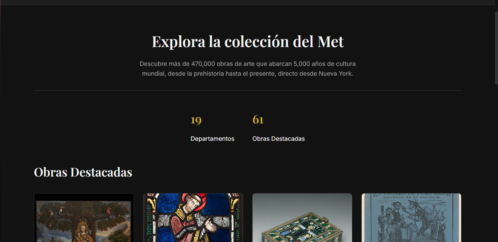
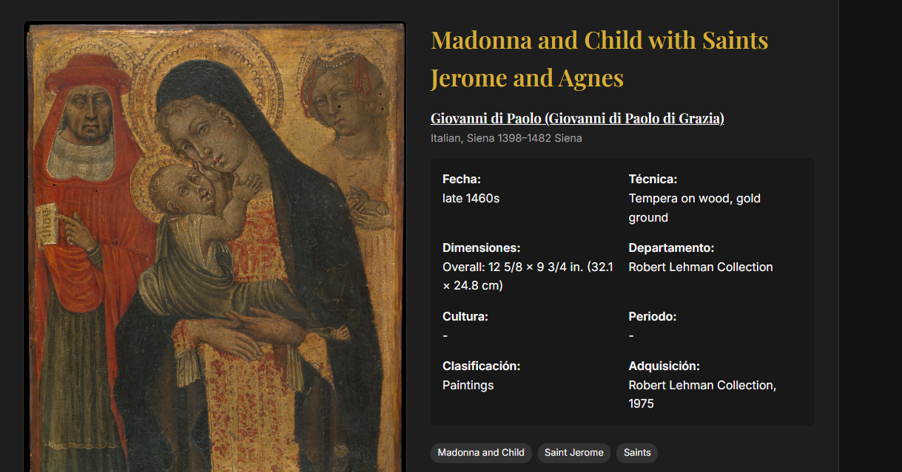
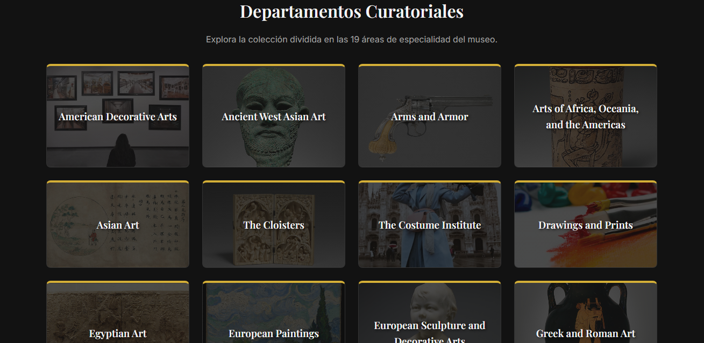
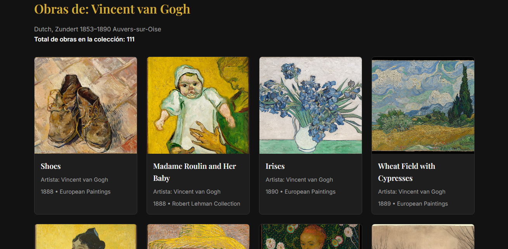
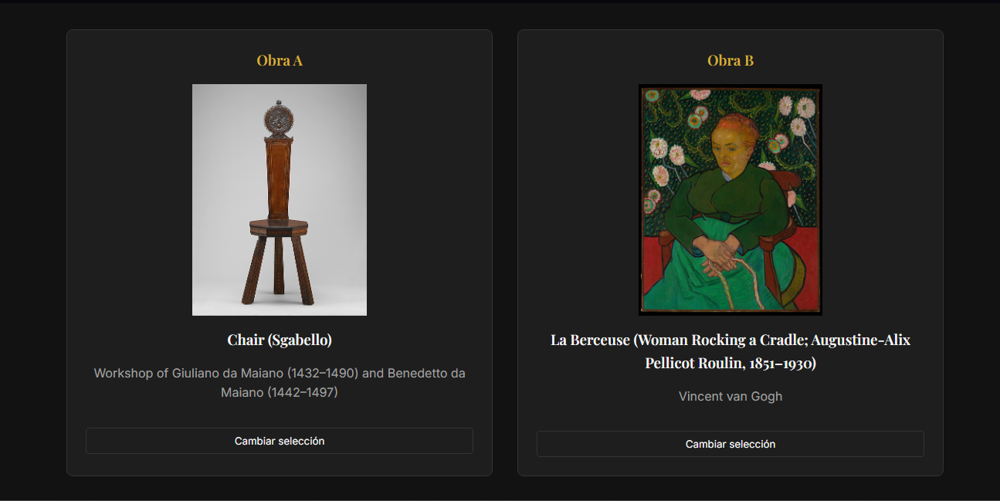

# MetHub - Explorador de la Coleccion del Met Museum

MetHub es una aplicacion web de pagina unica (SPA) desarrollada con HTML, CSS y JavaScript que permite explorar las obras del Metropolitan Museum of Art utilizando su Open Access API.

## Integrantes y Division del Trabajo

El desarrollo de este proyecto y la construccion del mismo se dividio de la siguiente manera:

Eric Vargas
- index.html
- css/style.css
- js/api.js
- js/app.js
- js/components.js
- js/view-explore.js
- js/view-departments.js

Santiago Carrasquero 
- js/router.js
- js/helpers.js
- js/view-home.js
- js/view-detail.js
- js/view-artist.js
- js/view-compare.js

## Instrucciones de Ejecucion

- Clonar o descargar el repositorio en el equipo local.
- Abrir el archivo index.html directamente en cualquier navegador web moderno.
- El proyecto funciona de manera independiente y no requiere servidor local ni configuraciones adicionales.

## Componentes Implementados

- met-navbar: Barra de navegacion principal que detecta y resalta dinamicamente la vista activa.
- met-footer: Pie de pagina estatico con creditos y la atribucion legal obligatoria del museo.
- loading-state: Indicador visual animado que se muestra durante las resoluciones asincronas de la API.
- error-state: Componente interactivo que captura fallos de red y proporciona un boton para reintentar la operacion.

## Capturas de Pantalla

## Decisiones Tecnicas Relevantes

- Proteccion del DOM: Se evito el uso de innerHTML para inyectar datos de la API, construyendo el DOM con createElement y textContent.
- Manejo de asincronia: utilizamos Promise.allSettled y procesamiento por lotes (batching) para resolver arreglos de IDs sin bloquear la aplicacion si una peticion individual falla.
- Resiliencia de red: Se implemento AbortController con un limite de tiempo definido en 12 segundos para cancelar peticiones colgadas y mostrar los estados de error personalizados.
- Enrutamiento SPA: Navegacion basada en fragmentos de URL con identificadores de vista para abortar renderizados asincronos si el usuario cambia de pagina prematuramente.

## Aviso Legal

Datos provistos por la Open Access API del Metropolitan Museum of Art. Esta aplicacion no esta afiliada al museo.

Realizado por Santiago Carrasquero y Eric Vargas

Lenguaje de Clientes Web 2026-B
